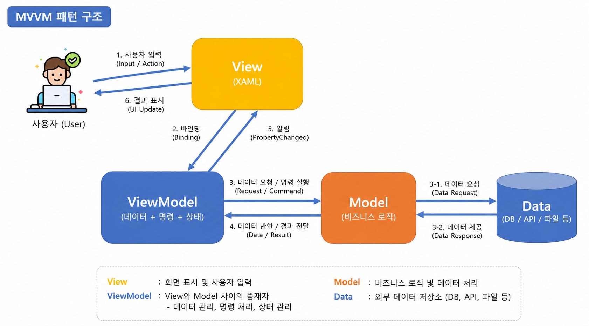

# 토이 프로젝트

## WPF MVVM 패턴 활용

### MVVM 패턴 개요

- MVC 패턴의 확장
    - C++, C# Winforms 예전 MVC 따로 사용
    - 팀으로 개발할 떄 디자인작업, 개발 작업 분리 공백을 줄이고자
    - 유지보수 시 구분된 레이어만 수정하면 되는 장점
    - 단일 개발보다 구현이 쉽지않음

- MVVM - Model - View - ViewModel
    - MVC 패턴과 차이점 - Controller 대신인 ViewModel이 아니고 `View`가 대문이다
    - View에서 동작의 처리를 시작, 이벤트 핸들러가 모두 사라짐
    - View에 해당하는 xaml.cs 파일에는 아무런 로직이 안들어감(디자이너가 로직을 생각지 말것)
    - 버튼, 키보드 이벤트가 모두 ViewModel로 넘어감 -> Command
    - 디버깅이 조금 어려움(몇몇)




-  ㅡMVVM 라이브러리 - 손쉽게 MVVM 구현을 도와주는 역활
    - CommunityToolkit.Mvvm - MS개발. 가장 일반적
    - Prism - MS관련 개발. 중대형 비즈니스용. 난이도 상
    - Caliburn.Micro - 간단한 MVVM 패키지 난이도 하 
    - Avalonia - 크로스플랫폼용 MVVM. 난이도 중

### MVVM 초간단 예제

- CommunityTii
- Models, Views, ViewModels 폴더(네임스페이스) 생성

#### Model 작성

```cs
namespace WpfMvvm01.Models
{
    internal class Person
    {
        public string Name { get; set; }
    }
}
```

#### ViewModel 생성

``` cs
using CommunityToolkit.Mvvm.ComponentModel;
using System;
using System.Collections.Generic;
using System.Text;

namespace WpfMvvm01.ViewModels
{
    // Observable (객체내용 변경 추적)
    // MainViewModel이 다른 클래스와 합쳐져서 컴파일 됨
    public partial class MainViewModel : ObservableObject 
    {
        [ObservableProperty]
        private string message = "안녕하세요";
    }
}

```

#### View 생성

-  Views/MainView.xaml 생성성

#### App.xaml 수정

- StartupUri 속성 삭제


### 실행화면


#### ViewModel에 버튼클릭 로직 

- MVVM은 Click이벤트 사용 안함 . 대신 Command 사용

```cs
public partial class MainViewModel : ObservableObject 
{
    [ObservableProperty]
    private string message = "안녕하세요"; // Message속성이나 자동생성

    [RelayCommand] // View에서 넘어온 명령을 처리
    private void ChangeMessage()
    {
        Message = "버튼 클릭 금지";
    }
}
```

#### View에 버튼 추가

- ViewModel의 RelayCommand 메서드명 + Command

```xml
<Button Content="변경" Command="Binding ChageMessageCommand">
```

#### 실행결과


- View는 디자이너 작업 - UI 설계서에 따라 속성값만 Binding으로 입력
- ViewModeld은 개발자 작업 - 속성은 ObservaleProperty로

#### 양방향

```xml
<TextBox FontSize="30" Text="{Binding Message, UpdateSourceTrigger=PropertyChanged}" />
<TextBlock FontSize="30" Foreground="Blue" Text="{Binding Message}" />
```


#### ListView 데이터바인딩

- ViewModel에 ObservableCollection 사용

```cs
public ObservableCollection<Person> People { get; } = 
[
    new Person { Name = "홍길동" },
    new Person { Name = "성유고" },
    new Person { Name = "애슐리" },
    new Person { Name = "김철수" },
];
```

- View에 ListView 추가

#### MahApp.Metro 디자인 지정

- App.xaml 추가

#### 패턴 폴더 생성

- Models, Views, ViewModels

#### MVVM 패턴에서 다이얼로그 처리

- MVVM 패턴에서 Mahapps.Metro의,
    - this.ShowMessageAsync() 메서드 사용 불가
- MVVM 패턴에 맞춰서 설정

- App.xaml.cs에서 MainViewModel 객체 생성시 파라미터 추가

```cs
private readonly IDialogCoordinator _coordinator;

public MainViewModel(IDialogCoordinator coordinator) {
    title = "BookRentalShop v1.1";
    this._coordinator = coordinator; // App.xaml.cs에서 생성하면서 넘어온 파라미터를 초기화
}
````

// 메서드 내에 사용법

MainView.xaml 루트태그에 다이얼로그 속성 추가 