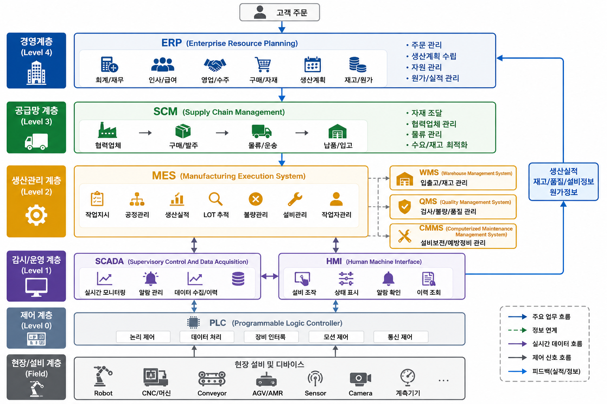
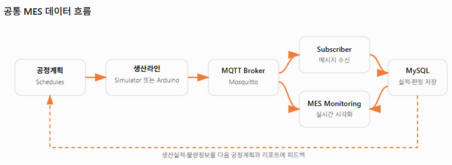

# 토이 프로젝트 5

## 컨베이어벨트 사용 공정관리 시스템

### 스마트 팩토리

- 공장 내 모든 설비와 시스템을 연결, 데이터를 기반으로 생산을 최적화하는 제조 시스템

## 공장시스템 종류

| 시스템명 | 역활 | 사용자 |
| :--:| :-- | :-- |
|SCM(공급체인관리) | 원자재 구매, 협력업체, 물류관리|구매팀, 물류팀|
|ERP(전시적자원관리)|회사 전체 업무 관리(결과위주)|경영지원, 회계, 영업, 인사...|
|MES(생산계획관리)생산 현장 관리|생산관리자|
|PCL(생산로직제어)|기계 제어|설비|
|SCADA|설비모니터링|생산현장|
|HMI(사람-기계 인터페이스)|작업자 화면(터치패널)|작업자|
|WMS(창고관리)|창고관리,재고관리|물류|
|QMS(품질관리)|품질관리,품질계획관리|품질|
|CMMS(유지보수관리)|설비 유지보수|설비팀|

- 공정관리
    - MES의 한 파트인 공정(MPR:자재 소요 계획)을 실시간으로 모니터링, 제어
    - 스마트팩토리로 실시간으로 양품, 불량을 선별 데이터 생성
    - Vision, IOT센서(적외선, X-ray,스캐너...)

- IIoT - Industrial IoT, 대규모, 높은 정밀도, 고가...

### 전체 시스템 구조



### 아두이노 컨베이어벨트



#### L298P 쉴드(NAT)

- 모터 드라이버를 포함한 아날로그 PWM, 디지털 GPIO를 구성한 쉴드
- 모터 드라이버 : 서보, DC등 모터를 쉽게 제어할 수 있도록 모듈화


- A - 디지털핀 13개
- B - 아날로그 확장 5개
- C - 아날로그핀 6개

- 확장판 1 - PWM 확장핀, 5v, D6, D5, GND, D3(A와 공유)
- 확장판 2 - 초음파센서 확장판, 5V, D8, D7, GND

- DC 모터 컨베이어 테스트
    - L298P 쉴드에 최소 9V 전원인가
``` cpp
int motorSppedPin = 10;
ont motorDirectionPin = 12;
int value;

void setup() {
  pinMode(motorDirectionPin, OUTPUT);
  noTone(4)
}

void loop() {
  digitalWrite(motorDirectionPin, HIGH);
  for (value = 0; value <= 255; value += 5) {
    analogWrite(motorSpeedPin, value);
    Delay(30)
  }
  delay(1000);
}
```

- DC 모터 컨베이어 테스트

- 기어드 DC 모더 제어
    - 0 ~255 사이에서 제어, 실제 50이하는 동작안함
    - Default 80
    - 10부터 시작하면 60에서도 동작안함. 255에서 부터 줄여가면 50에서도 동작

- Serial Monitor 사용 주의점
    - 시리얼 입력에서 New Line, Carriage Return 선택, 입력하면 값 이외에 다른 데이터 전달 됨


### 아두이노 컨베이어벨트 

### Unity 디지털트윈 시스템

### WPF 모니터링 시스템