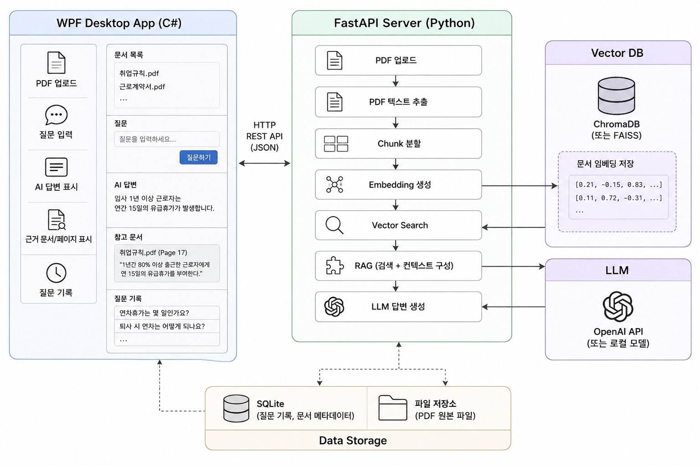
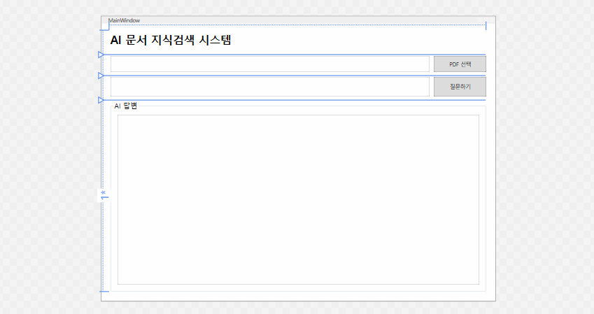
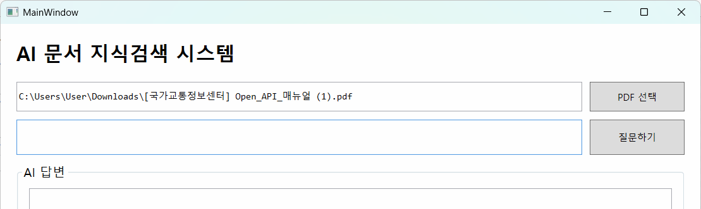

# 토이프로젝트

## AI 문서검색 . 질의응닫 시스템

### 



기업 문서를 기반으로 한 AI 지식검색 시스템 개발

- 사내 PDF 문서 등록해 두고, 사용자가 자연어로 질문을 하면 관련 문서를 찾아서 근거와 함께 답변을 해주는 WPF 원앱 프로그램을 구현

사용 기술


| 구분     | 기술               |
| -------- | :----------------- |
| 화면     | C# WPF             |
| 서버     | Python FastAPI     |
| PDF 처리 | Python             |
| 벡터 DB  | ?                  |
| AI 모델  | Ollama 또는 OpenAI |
| 통신     | REST API /JSON     |
| DB 저장  | ??                 |

#### RAG

Retrieval Augmented Generation : 검색(Retrieval) + AI 답변생성(Genera

내가 제공한 문서를 먼저 검색한 뒤 그 내용을 참고해서 답변하는 방식. 구글 노트북이 그 대표적인 사이트 [Gemini Notebook](https://notebook.google.com/?pli=1)

### 프로젝트 구성

```plaintext
ToyProject07(AIKnowlegeSystem)
|
|-Client(WPFClient) - 사용자 화면
|
|_Server(Aiserver) - FastAPI + Python Funtion

```

#### 최초구현

##### Visual Studio WPF 프로젝트 생성

WPF 애플리케이션 프로젝트 생성. .NET 10.0 (LTS) 선택

##### MainWidow.xaml 디자인



##### 파일 선택 구현



#### 서버구현


##### 가상환경 설정


FASTAPI
